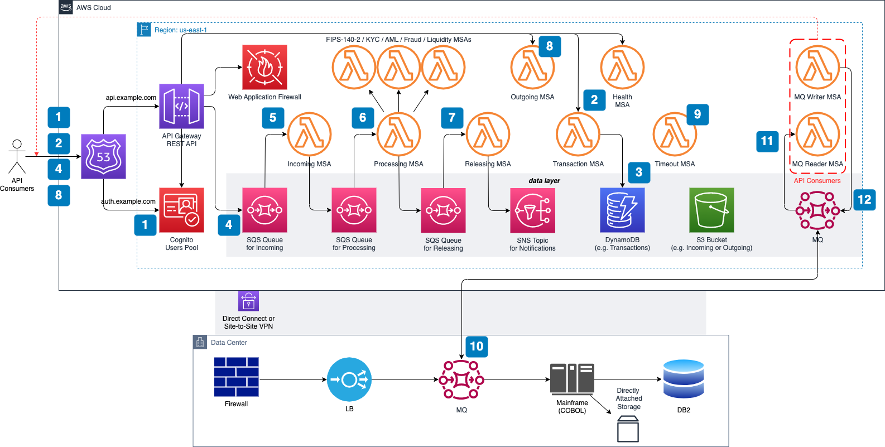

# ISO 20022 Messaging Workflows on AWS

ISO 20022 Messaging Workflows is an AWS Solution designed to receive,
consume, and release ISO 20022 payment messages. You can deploy this solution
as a proxy in front of your existing payments infrastructure, on-prem or
in the cloud, or use it as the foundational building block to modernize
existing payments systems.

This solution enables API consumers to control ISO 20022 messaging workflows
across multiple AWS regions by prioritizing either consistency or availability,
as well as by handling failover through rejection, cancellation, and re-drive
of data processing across AWS regions in case of regional failures.

Read [this blog post](https://bit.ly/iso20022blog) for additional data points
such as architecture choices and cost considerations.

## Event-Driven Architecture



### Step-by-Step Guidance

1. API consumer calls the regional AUTH endpoint associated with
a Region-specific Amazon Cognito's Client ID and Client Secret, and receives
the OAuth 2.0 Access Token (to be used with all subsequent API requests).

2. API consumer calls the regional API endpoint associated with
the Transaction MSA and receives HTTP 200 with a response payload that
includes a transaction ID (to be used with all subsequent API requests).

3. Transaction MSA generates UUID v4, verifies if it is unique within
the current partition in Amazon DynamoDB (transaction table), and records
the step in DynamoDB (status = ACCP). Otherwise it retries up to three times.

4. API consumer calls the regional API endpoint associated with Incoming Queue
and passes the transaction ID as HTTP header and ISO 20022 incoming message as
HTTP body (this step starts the internal event-driven workflow).

5. Incoming MSA consumes the ISO 20022 message from Incoming Queue, stores it
in an Amazon Simple Storage Service (Amazon S3) bucket (incoming path), records
the step in DynamoDB (status = ACTC), and pushes incoming message to Processing
Queue.

6. Processing MSA consumes the ISO 20022 message from Processing Queue,
runs technical and business validations including sync calls to other MSAs:
FIPS-140-2 / KYC / AML / Fraud / Liquidity / etc., records step in DynamoDB
(status = ACSP or RJCT), and pushes ISO 20022 confirmation or rejection
message to Releasing Queue.

7. Releasing MSA consumes the ISO 20022 message from Releasing Queue,
stores it in an S3 bucket (outgoing path), records the step in DynamoDB
(status = ACSC or RJCT), and pushes the notification
to Amazon Simple Notification Service (Amazon SNS).

8. API consumer calls the regional API endpoint associated with
the Outgoing MSA and receives HTTP 200 with the ISO 20022 outgoing message
as a response payload.

9. Timeout MSA executes every 15 seconds to retrieve any transaction that
exceeds SLA, generates the rejection ISO 20022 message, stores it in Amazon S3
(outgoing path), and records the new step in DynamoDB (status = RJCT).

10. OPTIONALLY, for on-premises downstream systems leveraging existing
messaging capabilities (e.g., IBM MQ, Kafka), deploy the same tool in the cloud
and use native replication between on-premises and cloud.

11. MQ Reader MSA consumes messages from cloud-based MQ and submits them
to the Incoming API (see the preceding Steps 1 through 5).

12. MQ Writer MSA consumes messages from Outgoing API and pushes them
to cloud-based MQ (see the preceding Steps 1, 2, and 9).

## Getting Started

### Pre-requisites

* an [AWS account](https://docs.aws.amazon.com/accounts/latest/reference/manage-acct-creating.html)
* already installed [AWS CLI](https://docs.aws.amazon.com/cli/latest/userguide/getting-started-install.html),
[Terraform](https://developer.hashicorp.com/terraform/tutorials/aws-get-started/install-cli), and
[Terragrunt](https://terragrunt.gruntwork.io/docs/getting-started/install/)
* [AWS access keys](https://docs.aws.amazon.com/accounts/latest/reference/credentials-access-keys-best-practices.html)
used by AWS CLI
* allowed AWS CLI permissions to create
[AWS Identity and Access Management (IAM) roles](https://docs.aws.amazon.com/IAM/latest/UserGuide/id_roles_create.html)
and [AWS CodeBuild project](https://docs.aws.amazon.com/codebuild/latest/userguide/planning.html) (e.g.,
[IAMFullAccess](https://docs.aws.amazon.com/aws-managed-policy/latest/reference/IAMFullAccess.html) and
[AWSCodeBuildAdminAccess](https://docs.aws.amazon.com/aws-managed-policy/latest/reference/AWSCodeBuildAdminAccess.html))
* an [Amazon Simple Storage Service (S3) bucket](https://docs.aws.amazon.com/AmazonS3/latest/userguide/create-bucket-overview.html)
used by Terraform remote state (e.g. *rp2-backend-us-east-1*)
* a custom domain with resolvable parent domain or subdomain
to a valid A record (e.g., *example.com* A alias to *8.8.8.8*)
* configured
[AWS Certificate Manager public certificate](https://docs.aws.amazon.com/acm/latest/userguide/gs-acm-request-public.html)
(e.g., nested *example.com* and wildcarded **.example.com*)

### Validate Pre-requisites

Starting at the ROOT level of this repository, run the following command:

  ```sh
  /bin/bash ./bin/validate.sh -q example.com -r us-east-1 -t rp2-backend-us-east-1
  ```

> REMINDER: Make sure to replace *example.com* with your custom domain,
*us-east-1* with your target AWS region and *rp2-backend-us-east-1* with
your S3 bucket.

Review output logs for any potential errors and warnings before moving forward
to the next step.

### Create CI/CD Pipeline

Starting at the ROOT level of this repository, run the following command:

  ```sh
  /bin/bash ./bin/deploy.sh -q example.com -r us-east-1 -t rp2-backend-us-east-1
  ```

> REMINDER: Make sure to replace *example.com* with your custom domain,
*us-east-1* with your target AWS region and *rp2-backend-us-east-1* with
your S3 bucket.

Once the build execution is successful, you should be able to login to AWS
Management Console, navigate to AWS CodeBuild service and see the newly created
project named something like *rp2-cicd-pipeline-abcd1234*.

The suffix *abcd1234* in your AWS CodeBuild project name is the solution
deployment ID. This value can be used to test this solution, once deployed
successfully.

### Deploy Solution

Using CI/CD pipeline created in the previous step, run the following commands:

  ```sh
  aws codebuild list-projects --region us-east-1 \
      --query 'projects[?contains(@, `rp2-cicd-pipeline`) == `true`]'
  ```

> REMINDER: Make sure to replace *us-east-1* with your target AWS region.

The output from the previous command should be used as the `project_name` input
in the next command (just replace *rp2-cicd-pipeline-abcd1234* with new value):

  ```sh
  aws codebuild start-build --region us-east-1 \
      --project_name rp2-cicd-pipeline-abcd1234
  ```

> REMINDER: Make sure to replace *us-east-1* with your target AWS region and
*rp2-cicd-pipeline-abcd1234* with the value from the previous command.

### Update DNS Provider

Once the build execution is successful, you need to retrieve newly created
custom domain names to update your DNS provider. Next, we will describe how to
retrieve them directly from Cognito and API Gateway using AWS CLI.

  ```sh
  aws cognito-idp describe-user-pool-domain --region us-east-1 \
      --domain auth-us-east-1.example.com \
      --query 'DomainDescription.{domain: Domain, target: CloudFrontDistribution}'
  ```

> REMINDER: Make sure to replace *us-east-1* with your target AWS region and
*auth-us-east-1.example.com* with your auth subdomain.

  ```sh
  aws apigateway get-domain-names --region us-east-1 \
      --query 'items[?contains(domainName, `example.com`) == `true`].{domain: domainName, target: regionalDomainName}'
  ```

> REMINDER: Make sure to replace *us-east-1* with your target AWS region and
*example.com* with your custom domain.

First command returns the domain name and target value of the AUTH endpoint.
This endpoint will be used to retrieve OAuth 2.0 Access Token. Second command
returns the domain names and target values of the API endpoints. Use these
domain names and target values to update your DNS provider.

### Run Tests

The suffix *abcd1234* in your AWS CodeBuild project name is the solution
deployment ID. This value can be used to test this solution, as shown below.

Test script is based on [curl](https://everything.curl.dev/get) and
[jq](https://jqlang.github.io/jq/download/). Make sure to have them
installed locally before executing below described command...

Starting at the ROOT level of this repository, run the following command:

  ```sh
  /bin/bash ./bin/test.sh -q example.com -r us-east-1 -i abcd1234
  ```

> REMINDER: Make sure to replace *example.com* with your custom domain,
*us-east-1* with your target AWS region and *abcd1234* with your solution
deployment ID.

## Considerations

1. Amazon Cognito custom domain deploys hosted UI using Amazon CloudFront
distribution under the hood which requires the public certificate in Amazon
Certificate Manager to be pre-configured in *us-east-1* region. Please make
sure to create public certificates in both your target region and *us-east-1*.
Terraform configuration where this behavior is defined can be viewed
[here](./iac.src/cognito_user_domain/data.tf#L12)

2. Amazon Cognito doesn't support top-level domains (TLDs) for custom domains.
To create an Amazon Cognito custom domain, the parent domain must have a Domain
Name System (DNS) A record. Create an A record for the parent domain in your
DNS configuration. When the parent domain resolves to a valid A record, Amazon
Cognito doesn't perform additional verifications. If the parent domain doesn't
point to a real IP address, then consider putting a dummy IP address, such as
"8.8.8.8", in your DNS configuration. Check
[this post](https://repost.aws/knowledge-center/cognito-custom-domain-errors)
for more details.

3. AWS Identity and Access Management (IAM) role configured for AWS CodeBuild
allows least privilege access. Build script assumes programmatically another
IAM role that provides elevated admin privileges and is restricted to your
target AWS account, AWS region and AWS CodeBuild IP range.
Terraform configuration where this behavior is defined can be viewed
[here](./iac.cicd/iam_role_codebuild/data.tf#L16) and
[here](./iac.cicd/iam_role_assume/data.tf#L8)

4. Amazon Web Application Firewall is deployed by default in non-blocking mode.
To change this behavior from `count` to `block`, update Terraform configuration
[here](./iac.src/waf_web_acl/main.tf#L16). To add more rules, update
Terraform configuration [here](./iac.src/waf_web_acl/locals.tf#L2)

5. Amazon Simple Storage Service blocks public access by default. This solution
removes this block on both account level and bucket level to enable health
checks managed via data plane of Amazon S3. Terraform configuration where this
behavior is defined can be viewed [here](./iac.src/s3_health/main.tf#L25) and
[here](./iac.src/s3_health/main.tf#L39)

6. Amazon EventBridge Scheduler is used to trigger every minute AWS Lambda
functions for `Timeout MSA` and `Recover MSA` . To change this behavior,
update Terraform configuration [here](./iac.src/scheduler_timeout/main.tf#L8)
and [here](./iac.src/scheduler_recover/main.tf#L8). We are still exploring
options to provide a more granular solution, down to every X seconds

## Cleaning Up

If you decide to clean up your AWS environment and remove all AWS resources
deployed by this solution, this can be easily achieved by running the following
two commands:

  ```sh
  /bin/bash ./bin/deploy.sh -c true -d iac.src -q example.com -r us-east-1 -t rp2-backend-us-east-1
  ```

  ```sh
  /bin/bash ./bin/deploy.sh -c true -d iac.cicd -q example.com -r us-east-1 -t rp2-backend-us-east-1
  ```

> REMINDER: Make sure to replace *example.com* with your custom domain,
*us-east-1* with your target AWS region and *rp2-backend-us-east-1* with
your S3 bucket.

## Security

See [CONTRIBUTING](./CONTRIBUTING.md#security-issue-notifications) for more
information.

## License

This library is licensed under the MIT-0 License. See the [LICENSE](./LICENSE)
file.
